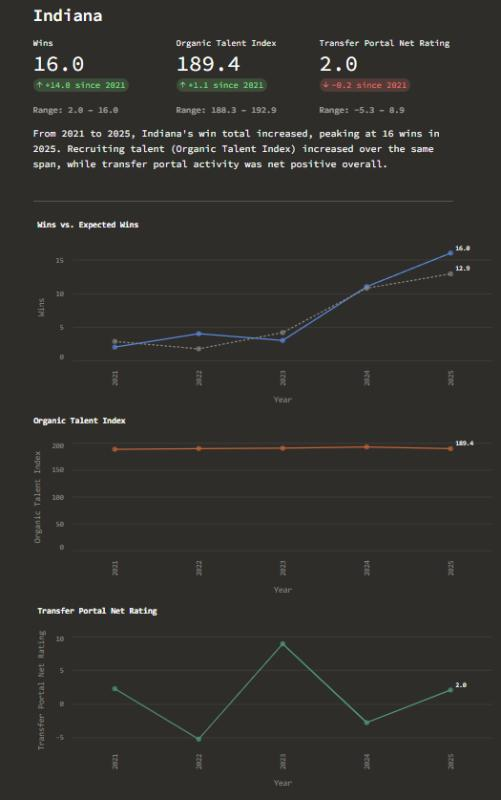

# CFB Analytics


**Does recruiting talent actually translate to wins, and how much does the transfer portal change that?**

An end-to-end data pipeline and interactive dashboard: it ingests five seasons of FBS data from the [CFBD API](https://collegefootballdata.com/) into SQLite, derives four candidate predictors of winning, and measures how strongly each one correlates with wins across every team-season since the transfer portal era began (2021–2025).

**Stack:** Python · pandas · SQLite · Streamlit · Altair · GitHub Actions

<!-- TODO: replace with a real screenshot or GIF of the dashboard (docs/dashboard.png) -->


## How it works

```
CFBD API ──> ingest.py ──> SQLite (7 tables) ──> analysis.py ──> dashboard.py
             (skips loaded   recruiting, records,   derived stats +     Streamlit:
              years, rate-   games, portal,         correlations        conference → team → trends,
              limited)       conferences, logos                         plus league-wide view
```

| File | Role |
|---|---|
| `db_setup.py` | Creates the SQLite schema (run once) |
| `ingest.py` | Pulls from the CFBD API and backfills the database; skips years already loaded |
| `analysis.py` | Joins everything into one team-season dataset and computes the derived stats |
| `dashboard.py` | Streamlit app with team drill-down and league-wide correlation view |
| `tests/` | Unit tests for the derived-stat functions, run in CI on every push |

## The derived stats

The working hypothesis is that a team's season comes down to four things:

- **Organic Talent Index**: not just this year's recruiting class, but a weighted blend of the last four, since freshmen rarely start and juniors are usually the core. Current weights: FR 20% / SO 30% / JR 35% / SR 15%.
- **Transfer Portal Net Rating**: talent gained minus talent lost through the portal, using player rating (or star rating as a fallback).
- **Strength of Schedule**: mean win percentage of opponents faced.
- **Close-Game Net**: wins minus losses in games decided by 8 points or fewer, a rough proxy for luck vs. being the better team.

Recruiting data goes back to 2018 so the 2021 season has four full classes behind it. Everything else starts in 2021, when the portal became a real factor.

## Limitations and next steps

- **Class weights are hand-picked.** Next step: fit them from the data instead of assuming them.
- **Correlation, not causation.** Talent and schedule are correlated with each other, so a multivariate regression would separate their effects better than four one-variable correlations.
- **Close-game net partly measures wins with wins,** so its correlation is inflated by construction.
- **Non-FBS opponents default to a .500 record** in strength of schedule, which slightly flatters teams with FCS games on their schedule.

## Running it locally

```bash
pip install -r requirements.txt
echo "CFBD_API_KEY=your_key_here" > .env   # free key from collegefootballdata.com
python test_env.py        # verify the key works
python db_setup.py        # create the schema
python ingest.py          # backfill 2018–2025
python analysis.py        # print the merged dataset and correlations
streamlit run dashboard.py
```

Run the tests with `pytest`.
